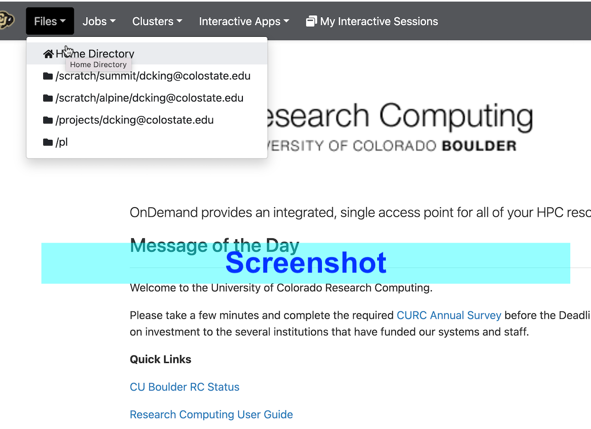
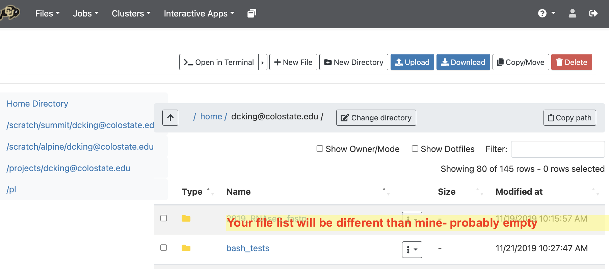

~~This workshop is designed to be run on pre-imaged Amazon Web Services 
(AWS) instances. For information about how to
use the workshop materials, see the 
[setup instructions](http://www.datacarpentry.org/genomics-workshop/setup.html) on the main workshop page.~~

This workshop is adapted to work on [CURC Alpine](https://curc.readthedocs.io/en/latest/clusters/alpine/index.html) for the graduate class CM580A3 at Colorado State University. All instructions that follow apply specifically to CSU users, and were determined in April of 2023. Some of the details may change with system administration changes.

## Getting an account for CSU users


### Step 1. You must have a valid CSU NetID and Duo two-factor authentication enabled

You must have a valid CSU NetID and Duo two-factor authentication enabled to apply for an account on Alpine through CSU.

### Step 2. Using DUO and NetID to request an account

**To get started, request a CU-Boulder account.** Note that you must use DUO to authenticate through this form. In the password field, type your CSU NetID password, then a comma, then the word “push” or the DUO key generated by your device.

For example, if your password was ilovealpine and your DUO key is 123456, you would type:

`ilovealpine,push`

OR

`ilovealpine,123456`

### Step 3. Request RMACC account.

[Request form for an account on the system](https://it.colostate.edu/research-computing-and-cyberinfrastructure/compute/get-started-with-alpine/)

Follow the instructions starting at **You will then be asked to provide information about your account.** (right above the screenshot).

### Step 4. Email Verification.

You should receive an immediate, open ticket confirmation from rc-help@colostate.edu.  The account will created by the system administrator and **you'll be notified by a second email.**

Once receiving that notification, you can log in to the system

## Logging on once your account is created

There are two ways to connect and use the Alpine system. One is through OnDemand (described below) and the other is a direct ssh from your computer.

 1. [https://ondemand-rmacc.rc.colorado.edu](https://ondemand-rmacc.rc.colorado.edu)
    - operates through tabs in web browser
    - can remember password, duo authentication 
    - graphical file browser, with upload/download options
    - file editor and terminal windows
 2. ssh from your terminal
    - `ssh -l eid@colostate.edu rc.colorado.edu`
    - sometimes it works better
    - sometimes it's the only way to get on the system
    - command line only
    - need password,push DUO every time


### OnDemand Walkthrough

Follow the link to https://ondemand-rmacc.rc.colorado.edu [click here](https://ondemand-rmacc.rc.colorado.edu). It should look similar to the image below:

#### Get there


#### File browser

Click "Files" to see the main directories you have access to.



Clicking on "Home Directory" loads a view of the home directory.



**NOTE** your home directory allows only 5Gb.

Click on the directory starting with `/projects/youreid@colostate.edu` to load that directory into your file browser. 

This has 250Gb and is permanent storage. We will install programs 
here and do most of our work here. If it is too large, or temporary
then we can use the directory starting with /scratch alpine.

Click on the directory starting with `/scratch/alpine/youreid@colostate.edu` to load that directory into your file browser. 
This directory has 1Tb of space available to you. It is deleted after 90 days, however, so you 
must have a data plan to compress it, or allow it to be deleted.

The directory starting with `/pl` is a larger allocation of space that your lab can buy into.

#### Shell window

Open a new tab in your browser by going to Clusters-&gt;Alpine_shell


## Setting up your account 

We want to:
 1. Download course material using command line `git`
 2. Use the conda installer (requires special setup steps)
 3. Set up your directory structure in the /projects directory since it has more space (250Gb)

I have put a setup script in the repo.

### Setup script 

Open an Alpine_shell and do the following 

**Whole class do this**
```
cd /projects/$USER
git clone https://github.com/Colorado-State-University-CMB/CM580A3-Intro-to-qCMB-2023 
cd CM580A3-Intro-to-qCMB-2023/10_Alpine_HPC
```

**New users do this**

```
# cd /projects/$USER/CM580A3-Intro-to-qCMB-2023/10_Alpine_HPC
bash CM580A3_Alpine_setup.sh
```

The script does the following:

 1. Configures your `.condarc` to download packages into your /projects space
 2. Configures your `.condarc` to add the "bioconda" channel (this is where bioinformatics programs come from)
 3. Configures your `.bashrc` to read commands from a special file which:
    1. Sources the system conda
    2. Adds aliases `sa` and `sq` to check slurm jobs


For users who are already set up with conda, you can look 
at the script to see if you need/want to incorporate any of these
actions.


**Once you have run the script**

then open a new Alpine_shell from the dashboard. Your prompt should start with the word `(base)`.


**Previous users** if your conda is not activated by default, add the following to your .bashrc if you want
to activate it when you log in:

`source /curc/sw/anaconda3/latest`


*We'll stop here to see what happened to everyone.*

---

## Supercomputing concepts 

### Submitting jobs

A cluster computer is more complicated than just logging on to a super machine. 
It allows us to distribute our computational workload across nodes and CPUs. 

That means that all the computationally heavy work must be done in a script that is passed to a job scheduler called SLURM-the system will then distribute the work to its 10s of thousands of resources using configuration variables added to the script. 

Generally, the scripts are submitted using a command called "sbatch", as below:

**EXAMPLE COMMAND**

```
sbatch scriptname.sh
# as opposed to 
bash scriptname.sh
```

... where scriptname.sh contains
 special commented lines that configure 
the job resources. 
They look like:

**EXAMPLE BATCH SCRIPT HEADER**

```
#SBATCH --ntasks=4
#SBATCH --nodes=1
#SBATCH --time=1:00:00
```
These "SBATCH" headers request
 4 CPUs on one node, for 1 hour.

All "SBATCH" headers go beneath a line
 called shebang, and must come before 
the commands of the script. 

**TEMPLATE BATCH SCRIPT**

```
#!/usr/bin/env bash
#SBATCH --ntasks=4
#SBATCH --nodes=1
#SBATCH --time=1:00:00

Command1

Command2
```

### Installing software

Installing software can 
require a lot of time in order
to download and compile source code.

Therefore, a special job is started in
order to isolate resources.

**Step 1** Initiate the compile session:

```
acompile --ntasks=4
```

You may have to wait for a few seconds.
 When it is ready, your prompt will
 return to you, but the host name will
be different.

### Building environments for the variant calling workflow

We will install programs into a few 
different environments in order to
better use class time. Normally, all programs
are installed into a single environment.

**Step 2** Create a conda environment 
for `fastq` and `trimmomatic` called `qc-trim` 

```
conda create --name qc-trim fastqc trimmomatic
```

This message is OK: **frozen solve failed**

The installation tries different "solves",
 but there is only an issue if the command quits.

After this step, conda will have figured
out what the requested programs need, and
will ask if you want to proceed.

You may get the following message:

```
==> WARNING: A newer version of conda exists. <==
  current version: 4.13.0
  latest version: 23.3.1
Please update conda by running
    $ conda update -n base -c defaults conda
```

IGNORE IT.

Hit **enter** to proceed with downloading
 and installation.

Once it is finished, **activate the environment**

**Step 3** activate the environment and confirm
 the programs are installed. 

```
conda activate qc-trim
```

Run fastqc without arguments
```
fastqc
```
Run trimmomatic without arguments
```
trimmomatic
```

We'll look at those help messages in depth
later. We are only verifying that we have
them.

**Important** whenever we want to call these 
programs, we have to have qc-trim activated first. 

### Alignment and variant calling

```
conda create env -n vcf bwa samtools bcftools
```

> ## Challenge
> 
> Activate the environment we just created 
and test that the software was installed.

> 
>> ## Solution
>> 
>> ~~~
>> conda activate vcf
>> bwa
>> samtools 
>> bcftools
>> ~~~
>> {: .bash}
>> 
>> The name of the environment is what 
>> we specified with the -n argument 
>> during `conda create`. Whereas the names 
>> of the programs were listed next. 
>> We check that they're installed by typing them
>> one at a time, each their own command without arguments. 
> {: .solution}
{: .challenge}

## Quit the `acompile` session


You may now *leave acompile* by typing `exit`
